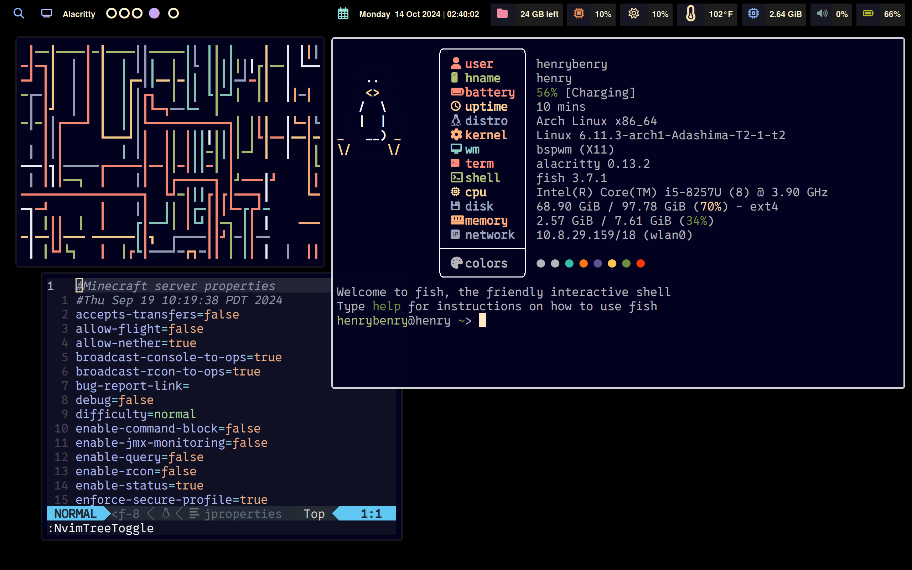
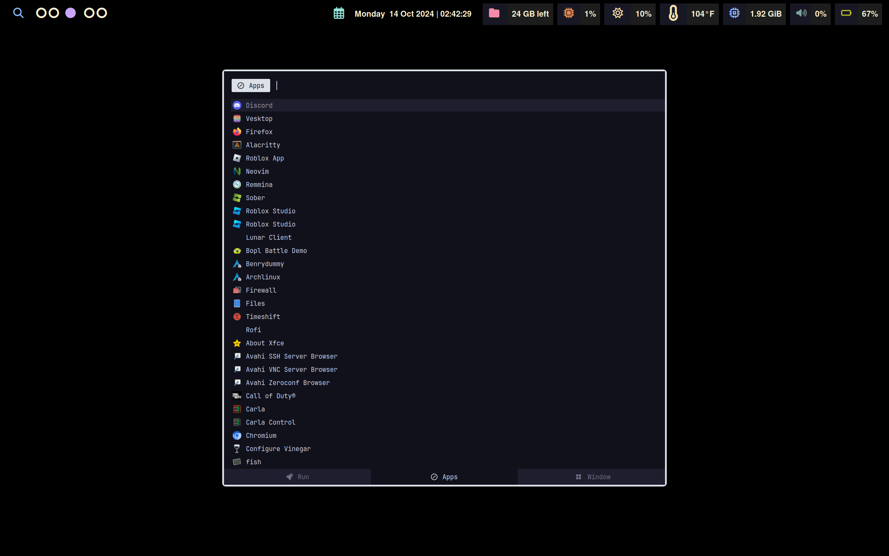

# Dotfiles

Hello world, welcome to my custom configuration for Arch Linux (Can be used for most linux distributions)
Below are images of how the setup works on a 2020 Intel Model Macbook Pro





Uses stow to link files to user directory
Will automatically create files with your user permission as how it's configured

# Installation

Make sure to update your system beforehand

```sh
pacman -Syu
```

## Things to download via your favorite package manager

### Available via package manager

```sh
pacman -Sy fish fastfetch polybar bspwm nvim coc sxhkd nautilus picom rofi dunst alacritty dmenu
```

### Download via curl

- Vencord
- yay

# Stow

Stow will allow you to create a symlink farm to your user directory on the dot files inside this directory

If you have the directories already, make sure to check both the directory and files inside have user permisssion for rw

```sh
pacman -Sy stow

stow .
stow --adopt . # For nested files
```
